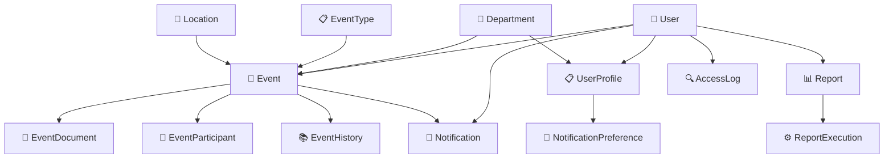

# EventoSys - Sistema de Gestão de Eventos Institucionais

## 📋 Visão Geral

O **EventoSys** é um sistema completo de gestão de eventos institucionais desenvolvido em Django, projetado para organizações que precisam gerenciar eventos de forma eficiente, transparente e segura. O sistema oferece controle de acesso baseado em roles, calendário interativo, relatórios automatizados e integração com calendários externos.

## 🏗️ Arquitetura do Sistema

### Stack Tecnológica

- **Backend**: Django 4.2.7 (Framework web Python)
- **Frontend**: Tailwind CSS (Framework CSS utilitário)
- **Banco de Dados**: SQLite (Desenvolvimento) / PostgreSQL (Produção)
- **Calendário**: FullCalendar.js (Interface de calendário interativo)
- **Autenticação**: Django Auth System (Sistema de autenticação nativo)
- **Relatórios**: ReportLab (PDF) + OpenPyXL (Excel)
- **Notificações**: Sistema interno de notificações

### Princípios de Design

- **Minimalismo**: Interface limpa e intuitiva
- **Responsividade**: Design adaptável para desktop e mobile
- **Acessibilidade**: Compatível com leitores de tela
- **Performance**: Otimizado para carregamento rápido
- **Segurança**: Controle de acesso rigoroso e auditoria completa

## 🎯 Módulos do Sistema

### 1. **Módulo de Autenticação e Usuários** (`accounts`)

#### Funcionalidades Principais:
- **Gestão de Usuários**: CRUD completo de usuários do sistema
- **Perfis Estendidos**: Informações adicionais além do usuário Django padrão
- **Controle de Acesso**: Sistema de três níveis de permissão
- **Logs de Segurança**: Auditoria completa de ações do usuário
- **Proteção Anti-Brute Force**: Prevenção de ataques de força bruta

#### Tipos de Usuário:
- **👑 Administrador**: Acesso total ao sistema
- **👨‍💼 Gestor**: Criação e gestão de eventos do departamento
- **👁️ Visualizador**: Visualização de eventos públicos e participação

#### Componentes:
```
accounts/
├── models.py          # UserProfile, AccessLog
├── views.py           # Login, registro, gestão de perfis
├── forms.py           # Formulários de usuário e perfil
├── utils.py           # Funções de permissão e logging
├── middleware.py      # Security logging e proteção
└── templates/accounts/
    ├── login.html
    ├── register.html
    ├── profile.html
    ├── profile_edit.html
    ├── access_logs.html
    └── user_management.html
```

#### Relacionamentos:
- **1:1** com Django User (através de UserProfile)
- **N:1** com Department (usuários pertencem a departamentos)
- **1:N** com AccessLog (logs de atividades)
- **1:N** com Event (usuários podem criar/responsabilizar eventos)

---

### 2. **Módulo de Eventos** (`events`)

#### Funcionalidades Principais:
- **CRUD de Eventos**: Criação, visualização, edição e exclusão
- **19 Tipos de Eventos**: Reuniões, audiências, palestras, etc.
- **Modalidades**: Presencial, virtual ou híbrido
- **Documentos**: Até 5 anexos por evento
- **Participantes**: Gestão de lista de participantes
- **Calendário Interativo**: Visualização em múltiplas formas
- **Versionamento**: Histórico completo de alterações

#### Status de Eventos:
- **📅 Planejado**: Evento agendado
- **▶️ Em Andamento**: Evento acontecendo
- **✅ Concluído**: Evento finalizado
- **❌ Cancelado**: Evento cancelado

#### Componentes:
```
events/
├── models.py              # Event, EventType, Department, Location
├── views.py               # Views principais de eventos
├── dashboard_views.py     # Dashboard de monitoramento
├── feed_views.py          # Feeds de calendário
├── forms.py               # Formulários de eventos
├── utils.py               # Exportação (PDF/ICS)
├── integrations.py        # Integrações externas
└── templates/events/
    ├── home.html
    ├── dashboard.html
    ├── event_list.html
    ├── event_detail.html
    ├── event_form.html
    ├── event_confirm_delete.html
    ├── calendar.html
    ├── calendar_integration.html
    └── public_calendar.html
```

#### Relacionamentos:
- **N:1** com EventType (cada evento tem um tipo)
- **N:1** com Department (eventos pertencem a departamentos)
- **N:1** com Location (eventos têm localizações)
- **N:1** com User (responsible_person e created_by)
- **1:N** com EventDocument (anexos do evento)
- **1:N** com EventParticipant (participantes do evento)
- **1:N** com EventHistory (histórico de alterações)

---

### 3. **Módulo de Notificações** (`notifications`)

#### Funcionalidades Principais:
- **Notificações em Tempo Real**: Alertas sobre eventos
- **Tipos de Notificação**: Criação, atualização, lembretes, cancelamentos
- **Preferências Personalizáveis**: Controle de recebimento
- **Prioridades**: Alta, média e baixa prioridade
- **Ações Requeridas**: Notificações que necessitam ação

#### Tipos de Notificação:
- **➕ Evento Criado**: Novo evento cadastrado
- **✏️ Evento Atualizado**: Alterações em eventos
- **⏰ Lembrete**: Proximidade de eventos
- **❌ Evento Cancelado**: Cancelamentos
- **🔧 Sistema**: Notificações administrativas

#### Componentes:
```
notifications/
├── models.py                    # Notification, NotificationPreference
├── views.py                     # Gestão de notificações
├── forms.py                     # Formulários de preferências
├── services.py                  # Serviços de envio
└── templates/notifications/
    ├── notification_list.html
    ├── notification_detail.html
    └── preferences.html
```

#### Relacionamentos:
- **N:1** com User (recipient - destinatário)
- **N:1** com Event (evento relacionado - opcional)
- **1:1** com NotificationPreference (preferências por usuário)

---

### 4. **Módulo de Relatórios** (`reports`)

#### Funcionalidades Principais:
- **Relatórios Personalizados**: Criação de relatórios customizados
- **Múltiplos Formatos**: PDF, Excel, CSV
- **Relatórios Rápidos**: Geração instantânea sem salvamento
- **Agendamento**: Execução programada de relatórios
- **Histórico de Execução**: Rastreamento de gerações

#### Tipos de Relatório:
- **📊 Eventos por Período**: Análise temporal
- **📈 Eventos por Tipo**: Distribuição por categoria
- **🏢 Eventos por Departamento**: Análise departamental
- **📋 Eventos por Status**: Situação atual dos eventos
- **👥 Participação**: Análise de participantes

#### Componentes:
```
reports/
├── models.py           # Report, ReportExecution
├── views.py            # Geração e gestão de relatórios
├── generators.py       # Geradores PDF/Excel/CSV
└── templates/reports/
    ├── list.html
    └── create.html
```

#### Relacionamentos:
- **N:1** com User (created_by - criador)
- **N:N** com Department (departamentos incluídos)
- **N:N** com EventType (tipos incluídos)
- **1:N** com ReportExecution (execuções do relatório)

---

## 🔄 Fluxo de Dados e Relacionamentos

### Diagrama de Relacionamentos Principais



### Fluxo de Trabalho Principal

1. **Autenticação**: Usuário faz login no sistema
2. **Dashboard**: Visualização personalizada baseada no role
3. **Gestão de Eventos**: 
   - Criação/edição por Administradores e Gestores
   - Visualização por todos os usuários autorizados
4. **Notificações**: Sistema automático baseado em ações
5. **Relatórios**: Geração sob demanda ou agendada
6. **Auditoria**: Registro automático de todas as ações

## 🛡️ Segurança e Controle de Acesso

### Sistema de Permissões

#### Administrador
- ✅ CRUD completo de eventos
- ✅ Gestão de usuários
- ✅ Acesso a todos os relatórios
- ✅ Visualização de logs de auditoria
- ✅ Configurações do sistema

#### Gestor
- ✅ CRUD de eventos do seu departamento
- ✅ Visualização de eventos públicos
- ✅ Relatórios básicos
- ❌ Gestão de usuários
- ❌ Logs de sistema

#### Visualizador
- ✅ Visualização de eventos públicos
- ✅ Eventos onde é participante
- ❌ Criação de eventos
- ❌ Relatórios
- ❌ Gestão administrativa

### Middleware de Segurança

```python
# Funcionalidades de Segurança Implementadas
- SecurityLoggingMiddleware      # Log de ações sensíveis
- BruteForceProtectionMiddleware # Proteção contra ataques
- SecurityHeadersMiddleware      # Headers de segurança HTTP
```

## 📅 Integração de Calendário

### Funcionalidades de Calendário

- **Visualizações**: Mensal, semanal, diária, lista
- **Filtros Avançados**: Por tipo, departamento, status, responsável
- **Cores Categorizadas**: 15 cores diferentes para tipos de evento
- **Exportação**: ICS (iCalendar) e PDF
- **Feeds Externos**: URLs para sincronização

### Integrações Externas

```python
# Integrações Disponíveis
- Google Calendar      # Adicionar eventos ao Google Calendar
- Microsoft Outlook    # Adicionar eventos ao Outlook
- Feeds ICS            # Subscrição de calendários externos
- Webhooks             # Notificações para sistemas externos
```

## 🚀 APIs e Endpoints

### Principais Endpoints

#### Eventos
- `GET /events/` - Lista de eventos
- `POST /events/create/` - Criar evento
- `GET /events/<id>/` - Detalhe do evento
- `PUT /events/<id>/edit/` - Editar evento
- `DELETE /events/<id>/delete/` - Excluir evento

#### Calendário
- `GET /calendar/` - Interface do calendário
- `GET /calendar/data/` - Dados JSON do calendário
- `GET /calendar/export/ics/` - Exportar ICS
- `GET /calendar/export/pdf/` - Exportar PDF

#### Feeds
- `GET /calendar/feed/user/<id>/<token>/` - Feed pessoal
- `GET /calendar/feed/department/<id>/` - Feed departamental
- `GET /calendar/feed/public/` - Feed público

## 📊 Dashboard e Monitoramento

### Métricas Principais

- **Eventos Hoje**: Contagem de eventos do dia atual
- **Eventos da Semana**: Eventos nos próximos 7 dias
- **Meus Eventos**: Eventos do usuário logado
- **Eventos por Status**: Distribuição por situação
- **Eventos por Tipo**: Categorização por tipo
- **Eventos Recentes**: Últimos eventos criados

### Dashboard de Monitoramento (Admin)

- **Métricas de Sistema**: Performance e uso
- **Análise de Tendências**: Padrões temporais
- **Logs de Acesso**: Auditoria de segurança
- **Status do Sistema**: Saúde da aplicação

## 🔧 Configuração e Deploy

### Requisitos do Sistema

```python
# requirements.txt principais
Django==4.2.7
reportlab>=3.6.0
openpyxl>=3.1.0
icalendar>=5.0.0
Pillow>=9.0.0  # Para upload de imagens
```

### Configurações Essenciais

```python
# settings.py - Configurações obrigatórias
INSTALLED_APPS = [
    'django.contrib.sites',  # Requerido para feeds
    'events',
    'accounts',
    'notifications',
    'reports',
]

SITE_ID = 1  # Requerido para django.contrib.sites
```

### Comandos de Setup

```bash
# Configuração inicial
py manage.py makemigrations events accounts notifications reports
py manage.py migrate
py manage.py createsuperuser  # OBRIGATÓRIO: Criar superusuário para admin
py manage.py collectstatic
py manage.py runserver
```

### Acesso ao Django Admin

**✅ Superusuário já configurado**: `admin`

Para acessar o Django Admin:
- **URL**: `http://127.0.0.1:8000/admin/`
- **Usuário**: `admin`
- **Senha**: Use a senha definida anteriormente ou redefina se necessário

**Funcionalidades disponíveis no Admin**:
- 🔧 **Gestão avançada de usuários**: Criar, editar, ativar/desativar usuários
- 📋 **Configuração de tipos de eventos**: Gerenciar os 19 tipos de eventos
- 🏢 **Gestão de departamentos**: Adicionar e configurar departamentos
- 📍 **Localização de eventos**: Configurar locais disponíveis
- 👥 **Perfis de usuário**: Gerenciar tipos e permissões
- 🔍 **Visualização de logs**: Auditoria de acesso e segurança
- ⚙️ **Configurações do sistema**: Ajustes gerais da aplicação

**Para redefinir senha do admin (se necessário)**:
```bash
py manage.py changepassword admin
```

## 📝 Logs e Auditoria

### Sistema de Logging

- **AccessLog**: Registro de acessos e ações
- **EventHistory**: Histórico de alterações em eventos
- **NotificationLog**: Registro de envio de notificações
- **ReportExecution**: Histórico de geração de relatórios

### Informações Registradas

- **Timestamp**: Data e hora da ação
- **Usuário**: Quem executou a ação
- **IP Address**: Endereço de origem
- **User Agent**: Navegador/dispositivo
- **Ação**: Tipo de operação realizada
- **Objeto**: Recurso afetado
- **Status**: Sucesso ou falha

## 🎯 Casos de Uso Típicos

### 1. Criação de Evento
```
Gestor/Admin → Login → Dashboard → Novo Evento → 
Preencher Formulário → Adicionar Documentos → 
Definir Participantes → Salvar → Notificações Enviadas
```

### 2. Consulta de Calendário
```
Usuário → Login → Calendário → Aplicar Filtros → 
Visualizar Eventos → Clicar em Evento → Ver Detalhes
```

### 3. Geração de Relatório
```
Admin/Gestor → Relatórios → Criar Novo → 
Definir Parâmetros → Escolher Formato → Gerar → Download
```

### 4. Gestão de Usuário (Admin)
```
Admin → Gestão de Usuários → Filtrar/Buscar → 
Selecionar Usuário → Editar/Desativar → Salvar
```

## 🔮 Funcionalidades Futuras

### Roadmap Planejado

- **📱 App Mobile**: Aplicativo nativo para iOS/Android
- **🔔 Push Notifications**: Notificações push em tempo real
- **📊 Analytics Avançado**: Dashboards interativos
- **🔗 Integrações**: Slack, Teams, Zoom
- **🤖 IA**: Sugestões de agendamento inteligente
- **📧 Email Marketing**: Campanhas para eventos públicos

### Melhorias Técnicas

- **🚀 Cache**: Redis para performance
- **📦 Docker**: Containerização completa
- **☁️ Cloud**: Deploy em AWS/Azure
- **🔍 Search**: ElasticSearch para busca avançada
- **📈 Monitoring**: Prometheus + Grafana

## 📚 Documentação Adicional

### Estrutura de Arquivos
```
eventosys/
├── eventosys/           # Configurações Django
├── events/              # Módulo principal de eventos
├── accounts/            # Gestão de usuários
├── notifications/       # Sistema de notificações
├── reports/             # Geração de relatórios
├── templates/           # Templates HTML
├── static/              # Arquivos estáticos
├── media/               # Uploads de usuários
├── requirements.txt     # Dependências Python
└── manage.py           # Utilitário Django
```

### Comandos Úteis

```bash
# Desenvolvimento
py manage.py runserver
py manage.py shell
py manage.py dbshell

# Produção
py manage.py check --deploy
py manage.py migrate --run-syncdb
py manage.py collectstatic --noinput

# Manutenção
py manage.py clearsessions
py manage.py cleanup_logs
py manage.py generate_reports
```

## 📄 Licença

Este projeto é propriedade institucional e está sujeito às políticas internas da organização.

---

**EventoSys v1.0** - Sistema de Gestão de Eventos Institucionais
*Desenvolvido com Django 4.2.7 + Tailwind CSS*